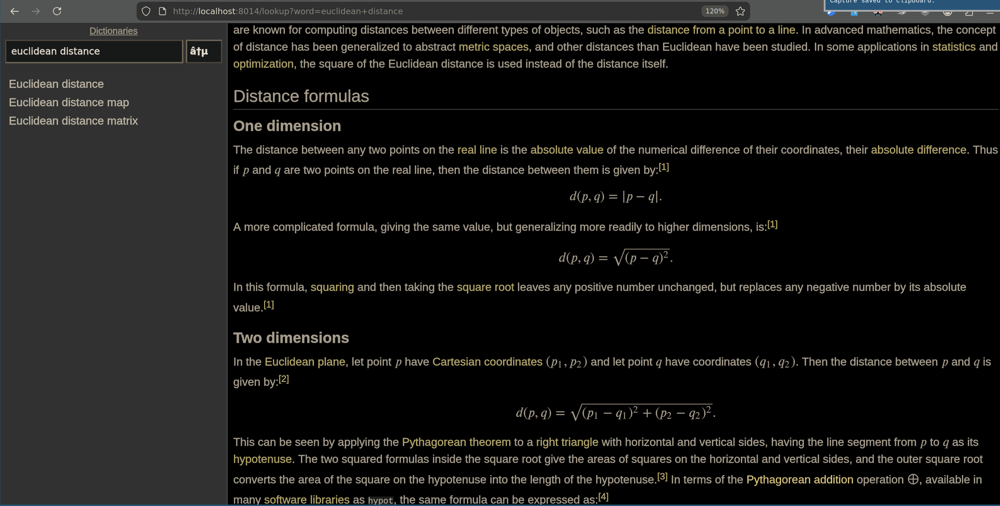

# Slobby

Slobby is a minimalistic web-based viewer for slob file content.

My change: added a proxy in front that fixes rendering of non-inline math
via MathJax. See difference:

Before, with just slobby:


After, over this mathjax_proxy.py:



## Installation

Create Python 3 virtual environment and install slob.py as
described at http://github.org/itkach/slob/. In this virtual
environment, then run:

```
pip install git+https://github.com/ttsiodras/slobby.git
```

## Usage

When Slobby starts, it opens specified slob files and starts a web
server, by default on port 8013, to allow browsing their content.

```
slobby [-h] [-p PORT] [-i INTERFACE] [-t THREADS] [-l LIMIT] [-b]
                 [-m MOUNT_PATH]
                 slob [slob ...]

positional arguments:
  slob                  Slob file name (or base name if opening slob split
                        into multiple files)

optional arguments:
  -h, --help            show this help message and exit
  -p PORT, --port PORT  Port for web server to listen on. Default: 8013
  -i INTERFACE, --interface INTERFACE
                        Network interface for web server to listen on.
                        Default: 127.0.0.1
  -t THREADS, --threads THREADS
                        Number of threads in web server's thread pool.
                        Default: 6
  -l LIMIT, --limit LIMIT
                        Maximum number of keys lookup may return. Default: 100
  -b, --browse          Open web browser and load lookup page
  -m MOUNT_PATH, --mount-path MOUNT_PATH
                        Website root. This facilitates setting up access
                        through a reverse proxy like nginx Default: /
```

For example, to serve all slob files in /~/Downloads// directory:

```
slobby ~/Downloads/*.slob
```

Once slobby is up, it listens on port 8013. To fix the math issues, launch
the proxy next:

```
cd mathjax_proxy/
python3 -m venv .venv
. .venv/bin/activate
python3 -m pip install -r requirements.txt
python3 mathjax_proxy.py
```

Then hit http://localhost:8014. The proxy will speak to slobby on port 8013
and fix the non-inline math, rendering them fully offline via MathJax in the browser.
